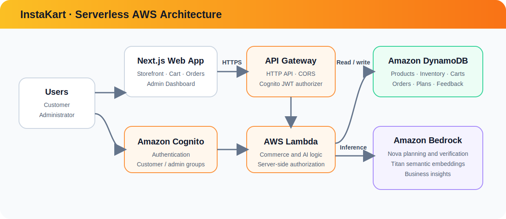

<div align="center">
  

  # InstaKart

  **Situation-aware quick commerce, powered by Amazon Bedrock**

  Describe the moment. Review a smart cart. Get essentials delivered fast.

  [](https://nextjs.org/)
  [](https://react.dev/)
  [](https://aws.amazon.com/)
  [](https://aws.amazon.com/bedrock/)
  [](https://www.typescriptlang.org/)

  [Live App](https://main.dcvcdyghn1yjx.amplifyapp.com)
</div>

---

## What is InstaKart?

InstaKart is an AI-powered quick-commerce platform built around a new shopping experience: **turning natural language needs into checkout-ready carts**.

Most ecommerce apps are product-first. Users search for each item manually, compare options, add products one by one, and build the cart themselves.

InstaKart is **situation-first**.

A user can simply say:

> “Guests are coming in 30 minutes.”  
> “I have a fever and need essentials fast.”  
> “Plan a quick breakfast for 4 people.”  
> “I need last-minute hostel snacks under ₹500.”

InstaKart understands the intent behind the request, detects urgency, estimates quantity, considers budget, checks inventory availability, compares delivery time, and generates a structured cart instantly.

The key innovation is the **natural-language-to-cart pipeline**: instead of making users search for products, InstaKart lets users describe the situation, and the system builds the cart intelligently.

Beyond cart generation, InstaKart includes a complete ecommerce workflow with user authentication, personalized carts, order history, profile management, admin inventory controls, stock tracking, out-of-stock handling, and business analytics.

InstaKart combines AI reasoning with real ecommerce operations, making the shopping flow faster, more contextual, and more human than traditional search-based commerce.

<div align="center">
  
</div>

## Highlights

| Experience | What it provides |
|---|---|
| 🧠 Situation-first shopping | Converts natural-language needs into relevant product bundles |
| ⚡ Smart cart modes | Fastest, Best Value, and Most Complete recommendations |
| 🎙️ Voice and text input | Lets customers describe urgent needs naturally |
| 🛒 Account-scoped commerce | Private carts, checkout, and order history per Cognito user |
| 📦 Live inventory | Quantity, availability, ETA, low-stock, and out-of-stock behavior |
| 🔐 Role-based access | Cognito `admin` group separates customer and administrator experiences |
| 📊 Business dashboard | Real inventory/order metrics, responsive charts, and revenue analytics |
| ✨ AI business insights | Bedrock insights with a deterministic fallback when AI is unavailable |

## Product surfaces

| Route | Audience | Purpose |
|---|---|---|
| `/` | Guest / customer | Browse products and generate situation-aware carts |
| `/admin` | Admin | Business metrics, charts, revenue trends, and AI insights |
| `/admin/inventory` | Admin | Search, filter, add, edit, restock, disable, or delete products |

Guests can browse and generate recommendations. Cart, checkout, profile, and
order actions require authentication.

## Architecture

<div align="center">
  
</div>

| Layer | Technology | Responsibility |
|---|---|---|
| Web app | Next.js 16, React 19, TypeScript | Storefront, auth UX, cart, orders, and admin UI |
| Styling | Tailwind CSS 4 | Responsive InstaKart design system |
| Charts | Recharts | Admin inventory and revenue visualization |
| Authentication | Amazon Cognito + AWS Amplify | Sessions, sign-up/sign-in, and group claims |
| API | API Gateway HTTP API | CORS, routing, and JWT authorization |
| Compute | AWS Lambda, Node.js 20 | Commerce logic, AI orchestration, and authorization |
| Database | Amazon DynamoDB | Products, inventory, carts, orders, plans, and feedback |
| AI | Amazon Nova + Titan Embeddings | Intent extraction, retrieval, planning, and insights |
| Deployment | AWS Amplify + Serverless Framework | Frontend and backend delivery |

## AI recommendation pipeline

```text
Customer situation
        ↓
Intent and urgency extraction
        ↓
Titan semantic retrieval + lexical fallback
        ↓
Nova cart planning
        ↓
Usefulness verification and reranking
        ↓
Fastest / Best Value / Most Complete carts
```

Unavailable products and products with zero quantity are excluded from AI
inventory candidates. If the planner fails or exceeds its response budget, the
backend creates a deterministic cart from the same live inventory.

## Authentication and authorization

InstaKart uses one Cognito User Pool for customers and admins.

| User state | Navigation and access |
|---|---|
| Guest | Login, Sign up, catalog browsing, and guest AI planning |
| Customer | Cart, My Orders, Profile, checkout, and personalized planning |
| Admin (`admin` group) | Dashboard, Inventory, and Logout only |

Security is enforced in Lambda as well as the UI:

- User identity comes from the verified Cognito `sub` claim.
- Cart and order APIs never trust a frontend `userId`.
- Admin APIs require `cognito:groups` to include `admin`.
- Local protected routes independently verify Cognito token signatures.
- Checkout validates current inventory and uses conditional DynamoDB writes.

### Create an admin

```bash
aws cognito-idp create-group \
  --user-pool-id YOUR_USER_POOL_ID \
  --group-name admin \
  --region ap-south-1

aws cognito-idp admin-add-user-to-group \
  --user-pool-id YOUR_USER_POOL_ID \
  --username USERNAME_OR_EMAIL \
  --group-name admin \
  --region ap-south-1
```

The user must **log out and sign in again** after assignment so Cognito issues
fresh tokens containing the group claim.

## Inventory behavior

| Inventory state | Customer behavior | AI behavior |
|---|---|---|
| `quantity >= 5` and enabled | Purchasable | Eligible |
| `quantity` from `1` to `4` | “Only X left” | Eligible |
| `quantity = 0` | “Out of stock”; Add disabled | Excluded |
| `isAvailable = false` | Unavailable even with stock | Excluded |

Legacy products without an explicit quantity use a migration-safe quantity of
`100` until an administrator saves a value.

## Getting started

### Prerequisites

- Node.js 20+
- npm
- AWS credentials with access to DynamoDB and Bedrock
- A Cognito User Pool and public app client
- Serverless Framework dependencies installed through `npm install`

### 1. Install dependencies

```bash
git clone https://github.com/nilaysrivastava/hackon6-amazon-prototype.git
cd hackon6-amazon-prototype

cd frontend && npm install
cd ../backend && npm install
```

### 2. Configure environment variables

Frontend:

```bash
cp frontend/.env.example frontend/.env.local
```

```env
NEXT_PUBLIC_API_BASE_URL=http://127.0.0.1:3001
NEXT_PUBLIC_COGNITO_USER_POOL_ID=ap-south-1_xxxxxxxxx
NEXT_PUBLIC_COGNITO_USER_POOL_CLIENT_ID=your_public_app_client_id
```

Backend variables:

```env
AWS_REGION=ap-south-1
ITEMS_TABLE=hackon6-items-dev
COGNITO_USER_POOL_ID=ap-south-1_xxxxxxxxx
COGNITO_USER_POOL_CLIENT_ID=your_public_app_client_id
```

See [`frontend/.env.example`](frontend/.env.example) and
[`backend/.env.example`](backend/.env.example) for the maintained templates.

### 3. Run locally

Terminal 1 — backend:

```bash
cd backend
source ../frontend/.env.local

COGNITO_USER_POOL_ID="$NEXT_PUBLIC_COGNITO_USER_POOL_ID" \
COGNITO_USER_POOL_CLIENT_ID="$NEXT_PUBLIC_COGNITO_USER_POOL_CLIENT_ID" \
npx serverless offline start \
  --host 127.0.0.1 \
  --httpPort 3001 \
  --ignoreJWTSignature
```

The offline gateway decodes the token for routing; Lambda independently
verifies its Cognito signature before protected data is accessed.

Terminal 2 — frontend:

```bash
cd frontend
npm run dev -- --hostname 127.0.0.1 --port 3000
```

Open [http://127.0.0.1:3000](http://127.0.0.1:3000).

> Do not use `--noAuth` while working with real carts, orders, inventory, or
> admin APIs. It removes the identity boundary needed by those routes.

## API reference

<details>
<summary><strong>Public and customer APIs</strong></summary>

| Method | Endpoint | Access | Purpose |
|---|---|---|---|
| `GET` | `/health` | Public | Service health |
| `GET` | `/now/products` | Public | Customer product catalog |
| `POST` | `/now/plan/guest` | Public | Anonymous, non-persisted AI cart |
| `POST` | `/now/plan` | Customer | Authenticated AI cart with user memory |
| `GET` | `/now/cart` | Customer | Load the signed-in user’s cart |
| `PUT` | `/now/cart` | Customer | Save the signed-in user’s cart |
| `DELETE` | `/now/cart` | Customer | Clear the signed-in user’s cart |
| `POST` | `/now/checkout` | Customer | Validate inventory and create an order |
| `GET` | `/now/orders` | Customer | List only the signed-in user’s orders |
| `GET` | `/now/orders/{orderId}/track` | Customer | Track an owned order |
| `POST` | `/now/feedback` | Customer | Save recommendation feedback |

</details>

<details>
<summary><strong>Admin APIs</strong></summary>

All routes require a verified Cognito token with membership in `admin`.

| Method | Endpoint | Purpose |
|---|---|---|
| `GET` | `/admin/inventory` | List full inventory |
| `POST` | `/admin/inventory` | Create a product |
| `PATCH` | `/admin/inventory/{id}` | Update details, quantity, or availability |
| `DELETE` | `/admin/inventory/{id}` | Delete a product |
| `GET` | `/admin/analytics` | Aggregate inventory and order metrics |
| `POST` | `/admin/analytics/insights` | Generate Bedrock or rule-based insights |

Bedrock receives aggregate business metrics only—not emails, Cognito IDs,
customer prompts, or raw order records.

</details>

<details>
<summary><strong>Development and maintenance APIs</strong></summary>

| Method | Endpoint | Purpose |
|---|---|---|
| `POST` | `/ask` | Bedrock connectivity check |
| `POST` | `/now/seed` | Catalog seeding guidance |
| `POST` | `/now/embed-products` | Generate missing product embeddings |
| `GET/POST` | `/items` | Development item endpoints |

</details>

## DynamoDB entity model

The prototype uses a single-table design.

| Entity | Primary identifier | Important attributes |
|---|---|---|
| Product | `prod_*` | category, price, quantity, availability, ETA, tags, embedding |
| Cart | `cart_<user-sub>` | userId, items, updatedAt |
| Order | `order_*` | userId, selected mode, plan, status, createdAt |
| Shopping plan | `plan_*` | userId, request, generated plan, model metadata |
| Feedback | `feedback_*` | userId, action, product and plan signals |

Global secondary indexes support product and user-entity queries.

## Useful commands

| Command | Directory | Purpose |
|---|---|---|
| `npm run dev` | `frontend` | Start Next.js development mode |
| `npm run lint` | `frontend` | Run ESLint |
| `npm run build` | `frontend` | Create a production build |
| `node --check src/handler.js` | `backend` | Validate Lambda syntax |
| `npx serverless print` | `backend` | Resolve and inspect deployment configuration |
| `npx serverless deploy` | `backend` | Deploy API Gateway and Lambda |

## Verification checklist

- Guest can browse and generate a cart.
- Protected actions open the shared Cognito login/sign-up modal.
- Cart and orders remain isolated between two customer accounts.
- Admin membership redirects to `/admin`.
- Customer tokens receive `403` from admin APIs.
- Quantity `0` disables customer purchase and removes the product from AI candidates.
- Admin inventory updates appear in the customer catalog.
- AI insights fall back safely when Bedrock is unavailable.

## Repository structure

```text
.
├── backend/
│   ├── data/                 # Seed catalog
│   ├── scripts/              # Catalog maintenance scripts
│   ├── src/handler.js        # Lambda handlers and business logic
│   └── serverless.yml        # API Gateway, IAM, and Lambda configuration
├── frontend/
│   ├── public/               # Brand and public assets
│   └── src/
│       ├── app/              # Customer and admin routes
│       ├── components/       # Storefront, cart, auth, and order UI
│       └── lib/              # Auth, API types, and shared helpers
└── README.md
```

---

<div align="center">
  <strong>Built with 🧡 for fast decisions when the situation matters.</strong>
</div>
